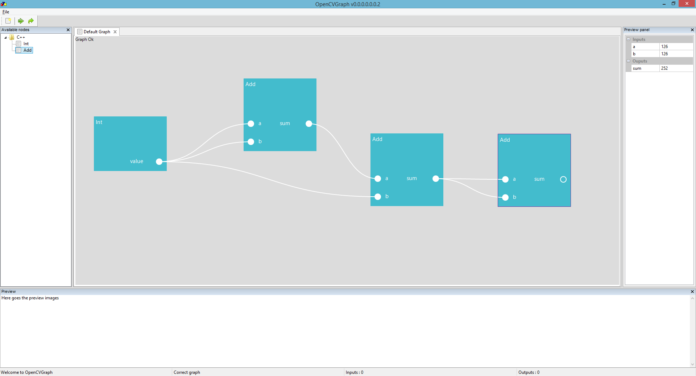

# OpenCVGraph
## Goal
Providing an user-friendly interface for building computer vision algorithms.
By moving and linking "nodes" representing different OpenCV functions, the user will build his algorithm without actually writing lines of code.

I want it to be extensible, so the nodes are packaged into DLLs and loaded dynamically at runtime (spices up the development)

## What's working
Features currently working :
* Loading nodes from DLLs
* Adding new nodes to a graph and moving them around
* Connecting nodes together by their "pins" (which represent nodes inputs/outputs)
* Running a live simulation (which updates automatically at each action on the graph)
* Displaying inputs and outputs for each node
* Deleting nodes and connections
* Scrolling in the graph canvas to have more space (no zoom in/out for instance)

## Screenshot
This is how the project looks like today :

